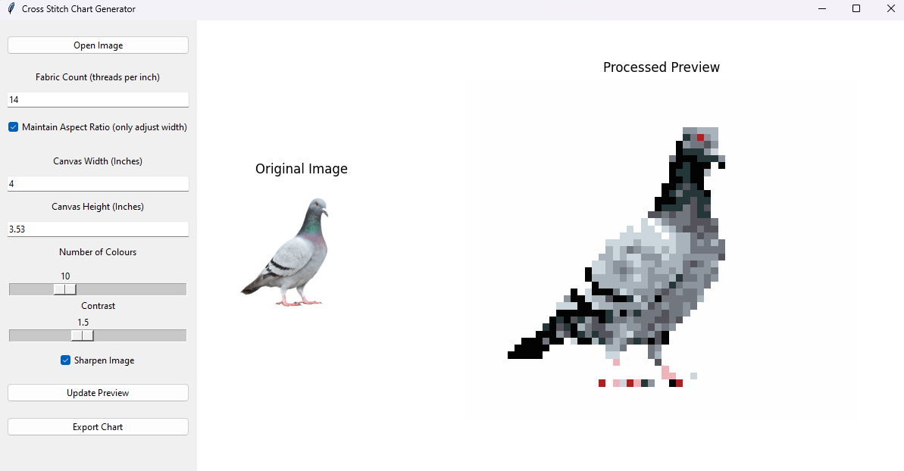
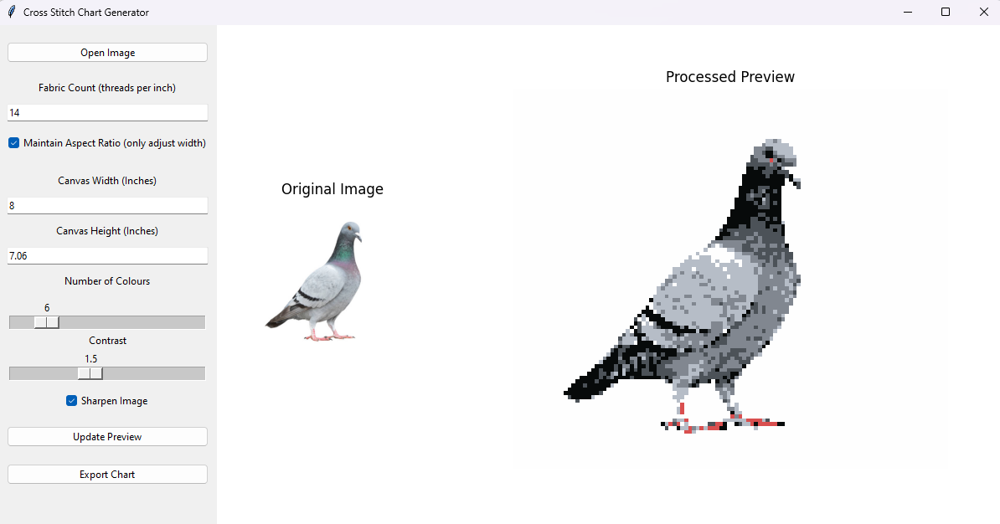
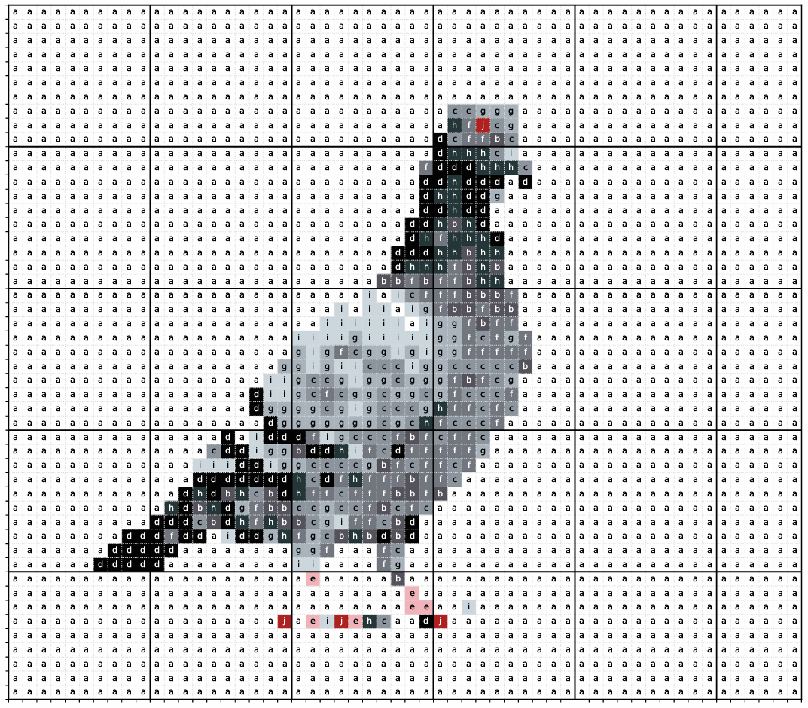
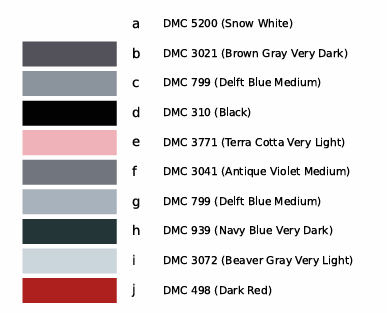

# Cross Stitch Chart Generator
This program converts images into colour charts for cross stitching and needlepoint.  Colour selection is based on a limited palette of DMC threads as a guide.

## Instructions for Use
### Image Settings
- Click 'open image' and navigate to the desired image (png/jpg/bmp format)
- Enter the thread count of the canvas
- Enter the desired dimensions of the finished canvas in inches.  To maintain the aspect ratio of the image, select 'maintain aspect ratio' and input only the width dimension; the height will automatically be scaled accordingly.
- Choose the number of colours you would like to use
- Adjust the contrast of the image as desired
- Toggle image sharpening on/off as desired
- Select 'Update Preview' to update the preview image of the colour chart

### Output Files
Once you are happy with the settings, click 'Export Chart'.  You will have two output PDF files:
1. Cross stitch pattern (colour chart)
2. Colour key mapped to DMC threads

## Demo

  
   
  <em>Figure 1: Example of image conversion to cross stitch image with 4in canvas width and 10 colours.</em>

  
   
  <em>Figure 2: Example of image conversion to cross stitch image with 8in canvas width and 6 colours.</em>

  
   
  <em>Figure 3: Cross stitch chart generated from settings in figure 1.</em>

  
   
  <em>Figure 4: Colour palette generated from settings in figure 1.</em>

